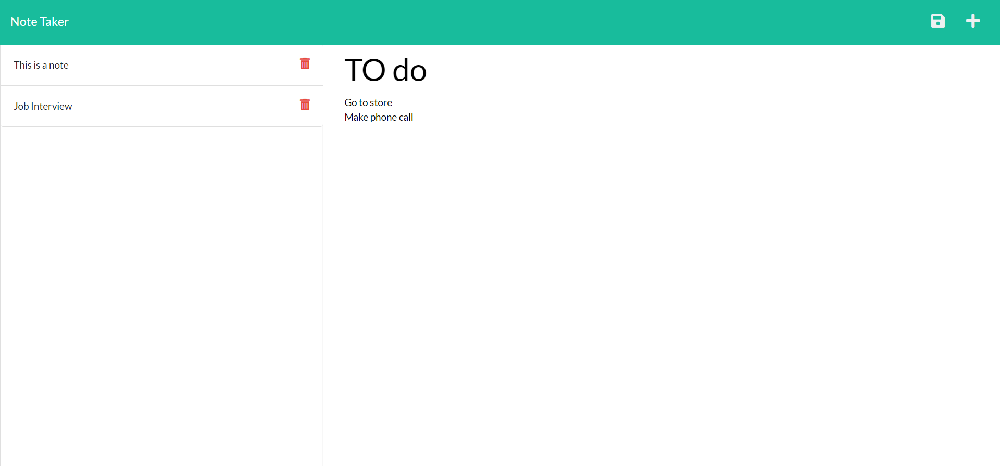

# Note Taker 

# Description
This app allows the user to create, save and delete notes. Each note contains a title and text body. The saved notes are displayed on the sidebar and can be accessed by clicking on them.

url: [https://sheltered-fjord-08198.herokuapp.com/](https://sheltered-fjord-08198.herokuapp.com/)

# Table of Contents
- [Installation](#installation)

- [Usage](#usage)

- [License](#license)

- [Contributing](#contributing)

# Installation
This app is deployed on the web and can be accessed using this [link](https://sheltered-fjord-08198.herokuapp.com/).

# Usage
To create a new note, fill in the title and note body and then click the save icon in the upper right corner. To view a sved note, click on it in the sidebar. To create a new note click the plush icon in the upper right corner.

# License 
    This project uses the The MIT License license.
    
    License Link: https://opensource.org/licenses/MIT

# Contributing
This app is not currently accepting contributions.

# Tests
N/A

# Questions
Github: [dmcaulay97](https://github.com/dmcaulay97)

Email: dmcaulay97@gmail.com
  